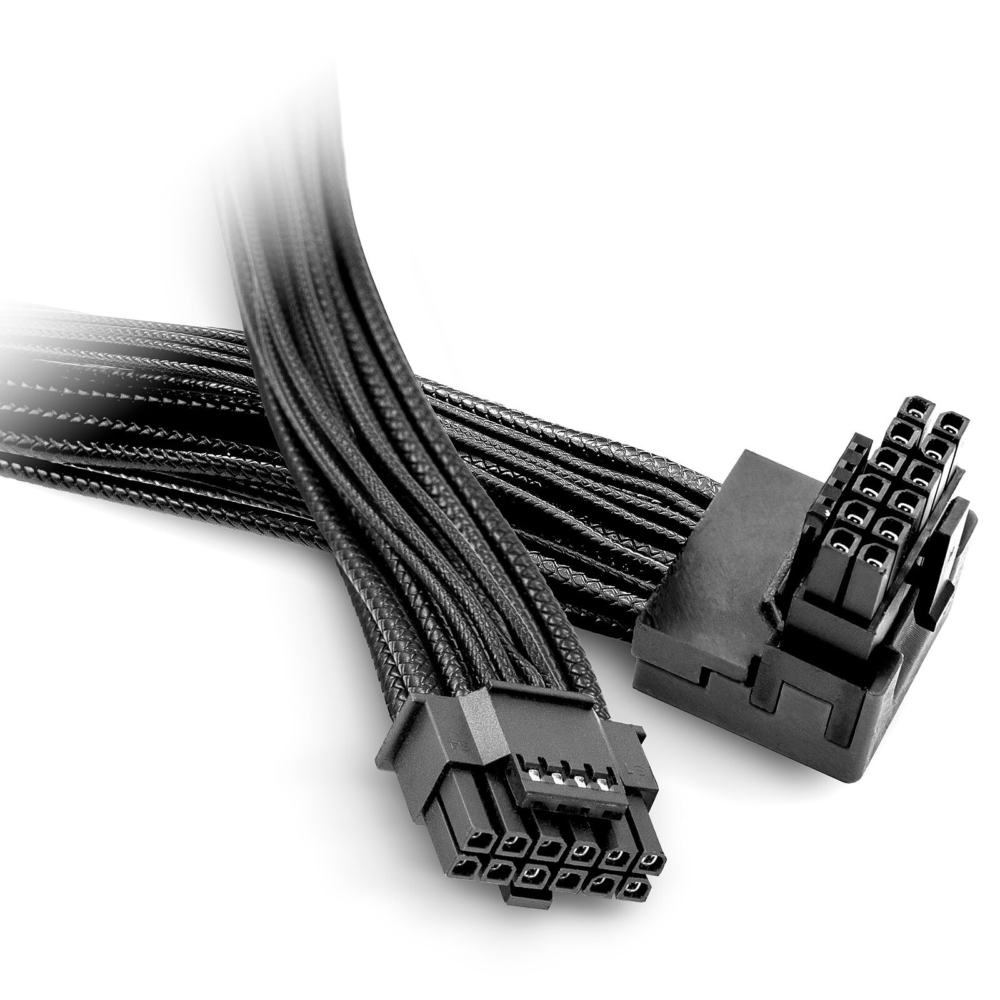

# Conector: 12VHPWR/12V-2x6

**Descripción breve:** Cable de alimentación de GPU de alta gama
**Pines/Carriles/Voltajes/Velocidad:** 12 + 4 / 2 de 6 pines · +12V · 600W
**Uso principal:** Alimentación de la GPU.
**Compatibilidad actual:** Alta (no en todos los casos)

## Identificación física
- Bloque rectangular de 12 pines con clip.

## Notas técnicas
- 12VHPRW 2.0 PCIe 5.0 está obsoleto y ha sido reemplazado por 12V-2x6 para la version PCIe 5.1 (con más alta compatibilidad).
## Fotos

## Fuentes
- https://www.ofzenandcomputing.com/12vhpwr-explained-expert-guide