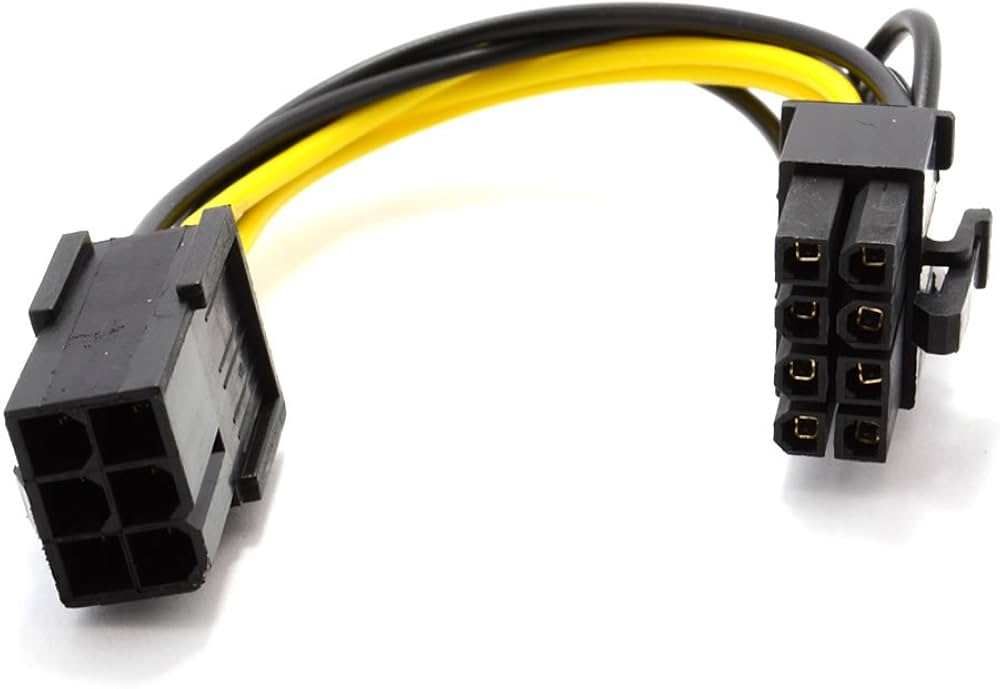

# Conector: PCIe 6/8p

**Descripción breve:** Cable de alimentación de GPUs dedicadas.
**Pines/Carriles/Voltajes/Velocidad:** 6/8 pines · +12V · 150W (6p)/300W (8p)
**Uso principal:** Alimentación de la GPU.
**Compatibilidad actual:** Alta

## Identificación física
- Bloque rectangular de 6/8 pines con clip conectada a la GPU

## Notas técnicas
- Por términos de compatibilidad, ahora se fabrican con 2 pines separados de los otros 6 (encajables entre sí para hacer 8).

## Fotos

## Fuentes
- https://computermesh.com/gpu-power-cable-guide-6-pin-8-pin-62-12-pin-pcie