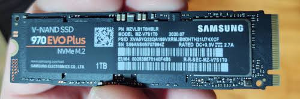
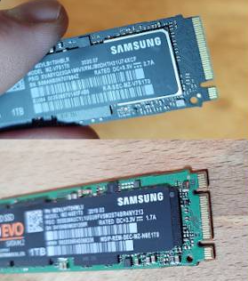

# Conector de datos: M.2 (NVMe/SATA)

**Descripción breve:** Es un factor de forma SSD para ordenadores ligeros y portátiles, notebooks, NUC y ultrabooks.
**Pines/Carriles/Voltajes/Velocidad:** 67 pines · x2 carriles ·  3.3V (media) · 1/2 GBps (PCIe 2.0/3.0)
**Uso principal:** Misma función que un SSD, unidad de almacenamiento. Aunque también puede usarse como tarjeta Wi-Fi o Bluetooth.
**Compatibilidad actual:** Alta

## Identificación física
- Unidad plana con forma de un paquete de chicles, de color variable (depende del fabricante) y normalmente atornillada a la placa por un solo tornillo localizado al lado contrario a los pines.

## Notas técnicas
- Compatible con puertos SATA y NVMe(PCIe) principalmente, aunque también puede ser compatible con puertos USB y tarjetas Wi-Fi/Bluetooth.

## Fotos

## Fuentes
* https://low-orbit.net/ultra-m.2
* https://www.kingston.com/es/blog/pc-performance/two-types-m2-vs-ssd#:~:text=factor%20de%20forma.-,M.,capacidad%20de%20hasta%202%20TB
* https://www.delkin.com/wp-content/uploads/2020/05/401-0461-00-Rev-D-M.2-2280-PCIe-Industrial-TLC-Engineering-Specification.pdf