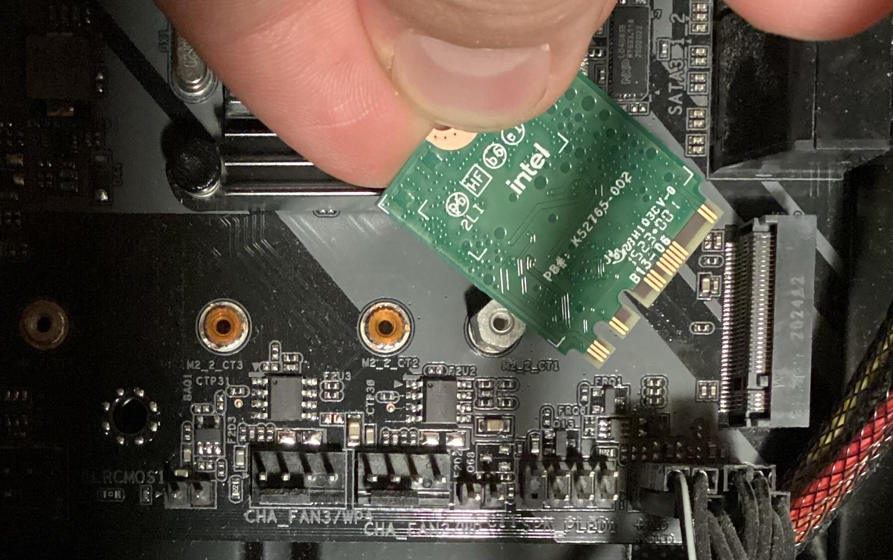

# Slot: PCIe M.2 (Gen4/Gen5)

**Descripción breve:** Ranura de expansión usada para SSD, tarjetas de red Wi-Fi/Bluetoth.
**Pines/Carriles/Voltajes/Velocidad:** x2/x4 carriles PCIe · Gen 4 5.91 GB/s (media) · Gen 5 11.82 GB/s (media).
**Uso principal:** Tarjetas de red y SSDs normalmente.
**Compatibilidad actual:** Alta

## Identificación física
- Son pequeñas ranuras, usualmente negras.

## Notas técnicas
- Normalmente instaladas en PC ligeros y portátiles por el poco espacio que ocupan.

## Fotos

## Fuentes
- https://ibericavip.com/blog/pc-workstation/tipos-de-unidades-y-ranuras-m-2-una-guia-detallada