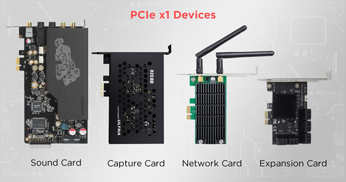

# Slot: PCI Express x1 (Gen4/Gen5)

**Descripción breve:** Ranura de expansión de bajo ancho de banda y menor tiempo de transferencia que sus sucesoras.
**Pines/Carriles/Voltajes/Velocidad:** x1 carril · Gen 4 2GB/s · Gen 5 4GB/s
**Uso principal:** Son utilizados normalmente por tarjetas: de red, de expansión de puertos, de captura y de sonido.
**Compatibilidad actual:** Alta

## Identificación física
- Son ranuras mucho más pequeñas que las convencionales (x16), de color variable (depende del fabricante), como pequeños bloques de LEGO.

## Notas técnicas
- Ancho de banda limitado a sus funciones pero efectivo para estas.

## Fotos

## Fuentes
- https://ibericavip.com/blog/pc-workstation/para-que-se-utilizan-las-ranuras-pcie-x1-pequenas/
- https://hardzone.es/tutoriales/componentes/puertos-pcie-tipos-placas-base/#349320-tipos-de-puertos-pcie
- https://www.techreviewer.com/tech-answers/how-fast-is-pcie-5