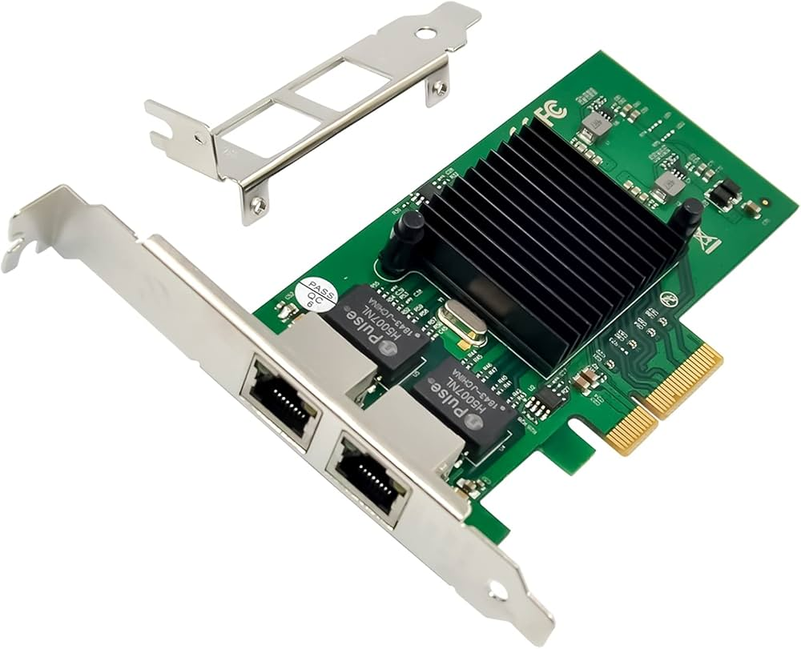

# Slot: PCI Express x4 (Gen4/Gen5)

**Descripción breve:** Ranura de expansión raramente vista en placas debido a sus reducidos usos.
**Pines/Carriles/Voltajes/Velocidad:** x4 carriles · Gen 4 8GB/s · Gen 5 16GB/s
**Uso principal:** Comparte usos con PCIe x1, pero también admite adaptadores M.2 y NVMe y controladoras RAID.
**Compatibilidad actual:** Baja

## Identificación física
- Son un poco más grandes que los PCIe x1, color variable (según el fabricante)

## Notas técnicas
- Es más potente que las PCIe x1, pero debido a su escaso uso, pasan desapercibido.

## Fotos

## Fuentes
- https://ibericavip.com/blog/pc-workstation/todos-los-tipos-de-ranuras-pcie-explicados-y-comparados
- https://hardzone.es/tutoriales/componentes/puertos-pcie-tipos-placas-base/#349320-tipos-de-puertos-pcie
- https://www.techreviewer.com/tech-answers/how-fast-is-pcie-5
