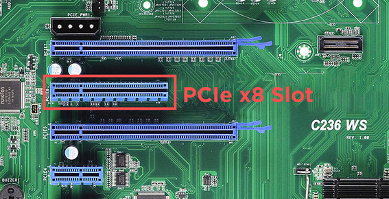
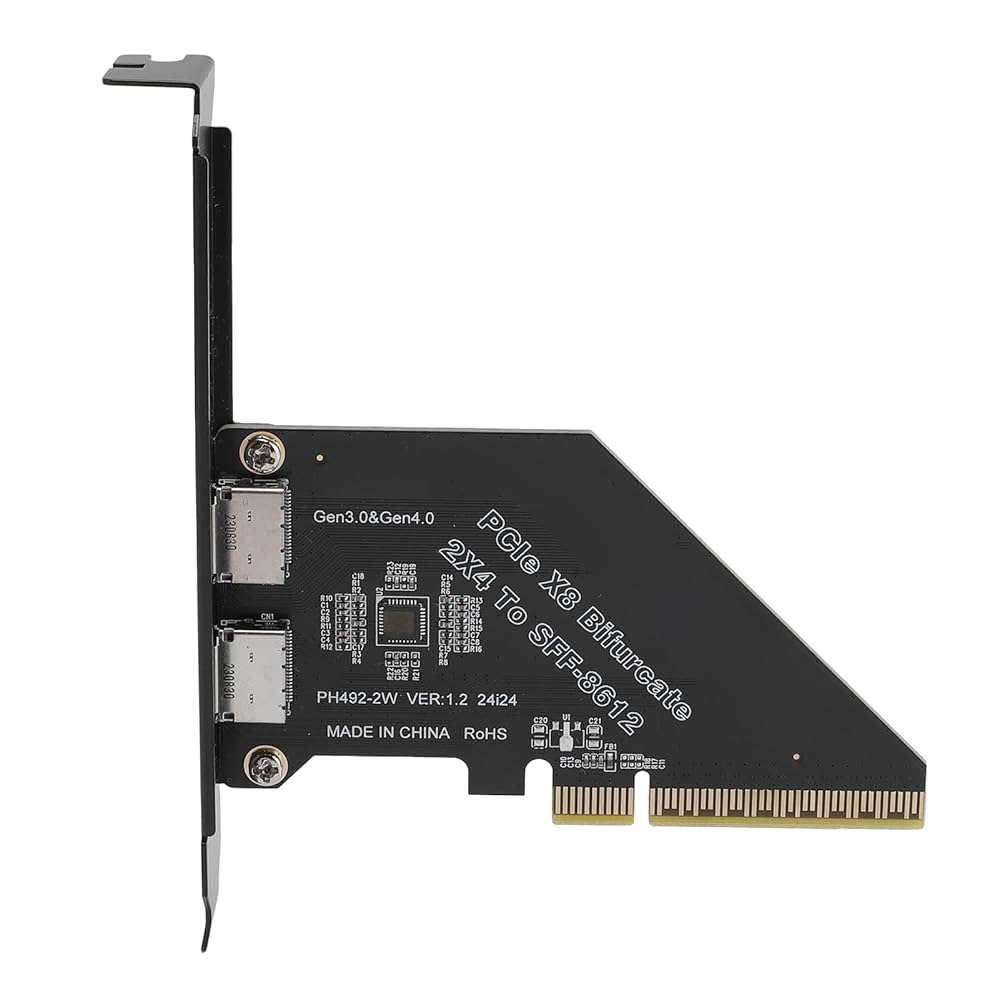
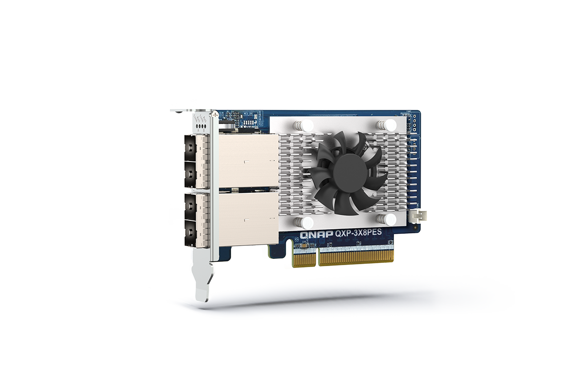

# Slot: PCI Express x8 (Gen4/Gen5)

**Descripción breve:** Ranura de expansión no tan rara como la anterior, pero igualmente opacada por su sucesora.
**Pines/Carriles/Voltajes/Velocidad:** x8 carriles · Gen 4 16GB/s · Gen 5 32GB/s
**Uso principal:** Empieza a poder usaserse para GPU de gama baja y adaptadores NVMe Multi-Ranura.
**Compatibilidad actual:** Media

## Identificación física
- Son ranuras notablemente más largas y solían ir junto a las de x16 en placas algo más antiguas, color variable (según el fabricante)

## Notas técnicas
- Ancho de banda preparado para soportar GPUs de bajagama y un mayor ancho de banda.

## Fotos

## Fuentes
- https://ibericavip.com/blog/pc-workstation/todos-los-tipos-de-ranuras-pcie-explicados-y-comparados
- https://hardzone.es/tutoriales/componentes/puertos-pcie-tipos-placas-base/#349320-tipos-de-puertos-pcie
- https://www.techreviewer.com/tech-answers/how-fast-is-pcie-5