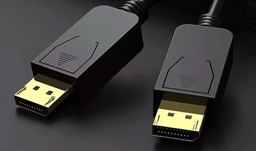

# Conector externo: DisplayPort 1.4/2.X

**Descripción breve:** Conector más moderno multimedia de transmisión de video y sonido.
**Pines/Carriles/Voltajes/Velocidad:** 1.4 => 8K 60 Hz // 2.0 => 16k 60Hz/8k 120Hz
**Uso principal:** Utilizado comúnmente monitores, ordenadores y tarjetas gráficas. 
**Compatibilidad actual:** Alta.

## Identificación física
- Forma rectangular y la esquina inferior derecha hace un ángulo mayor a 90º.
## Notas técnicas
- Algunos cables tienen un botón para evitar desconexiones accidentales.

## Fotos

## Fuentes
- https://cabletimetech.com/es-es/blogs/knowledge/displayport-1-2-displayport-1-4-displayport-2-0-and-displayport-2-1-whats-the-difference