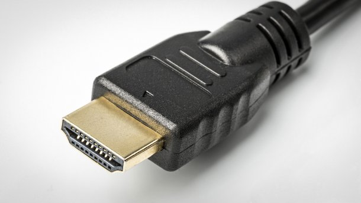

# Conector externo: HDMI 2.1/2.2

**Descripción breve:** Conector multimedia de transmisión de video y sonido.
**Pines/Carriles/Voltajes/Velocidad:** 2.1 48 Gbps 8K 120 Hz // 2.1 96 Gbps 12K 120 Hz/4K 480 fps
**Uso principal:** Proporcionar de audio y señal de vídeo digital a monitores, televisiones, etc...  
**Compatibilidad actual:** Alta.

## Identificación física
- Tiene la forma de un trapezoide más ancho y plano.

## Notas técnicas
- También hay distintos "sub-tipos" de HDMIs con funciones más especializadas, como:
    - Dynamic HDR, que mejora el contraste por escena.
    - VRR (Variable Refresh Rate) que está más enfocado para videojuegos.

## Fotos

## Fuentes
- https://www.profesionalreview.com/2025/01/08/hdmi-2-2-vs-hdmi-2-1