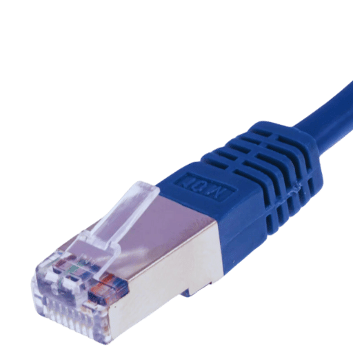

# Conector externo: Cable Ethernet RJ45

**Descripción breve:** Estándar (Ethernet) para conexiones red cableadas
**Pines/Carriles/Voltajes/Velocidad:** 8 pines // 100Mbps/1Gbps/10Gbps
**Uso principal:** Conectar dispositives a una red privada/pública. 
**Compatibilidad actual:** Alta.

## Identificación física
- Forma rectánfular con una pequeña protuberancia/bulto en la parte superior.
## Notas técnicas
- Esta parte que sobresale es una pestaña que debe presionarse si se quiere desconectar, evitando accidentes de desconexión.

## Fotos

## Fuentes
- https://www.profesionalreview.com/2020/02/29/cable-rj45