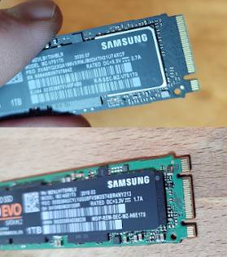
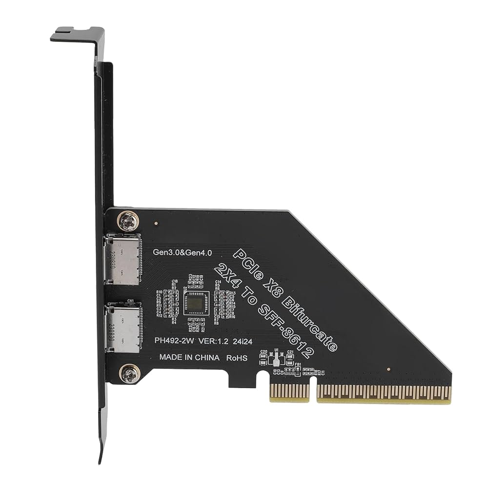

# ENTREGA ÚNICA - Reto 01

> Exporta este archivo como **PDF único** con nombre:
> `apellido1_apellido2_nombre_FHW01_Tarea`  *(sin ñ ni tildes)*

## Índice

- [ENTREGA ÚNICA - Reto 01](#entrega-única---reto-01)
  - [Índice](#índice)
  - [Portada](#portada)
- [Reto 1 — Investigación\_Desarrollo\_Conectores\_Slots](#reto-1--investigación_desarrollo_conectores_slots)
  - [1. Introducción](#1-introducción)
- [Introducción](#introducción)
  - [2. Conectores internos (energía)](#2-conectores-internos-energía)
- [Conector: ATX de 24 pines](#conector-atx-de-24-pines)
  - [Identificación física](#identificación-física)
  - [Notas técnicas](#notas-técnicas)
  - [Fotos](#fotos)
  - [Fuentes](#fuentes)
- [Conector: EPS 8p (4+4)](#conector-eps-8p-44)
  - [Identificación física](#identificación-física-1)
  - [Notas técnicas](#notas-técnicas-1)
  - [Fotos](#fotos-1)
  - [Fuentes](#fuentes-1)
- [Conector: Power SATA](#conector-power-sata)
  - [Identificación física](#identificación-física-2)
  - [Notas técnicas](#notas-técnicas-2)
  - [Fotos](#fotos-2)
  - [Fuentes](#fuentes-2)
- [Conector: PCIe 6/8p](#conector-pcie-68p)
  - [Identificación física](#identificación-física-3)
  - [Notas técnicas](#notas-técnicas-3)
  - [Fotos](#fotos-3)
  - [Fuentes](#fuentes-3)
- [Conector: 12VHPWR/12V-2x6](#conector-12vhpwr12v-2x6)
  - [Identificación física](#identificación-física-4)
  - [Notas técnicas](#notas-técnicas-4)
  - [Fotos](#fotos-4)
  - [Fuentes](#fuentes-4)
  - [3. Conectores de datos](#3-conectores-de-datos)
- [Conector de datos: SATA (Serial ATA)](#conector-de-datos-sata-serial-ata)
  - [Identificación física](#identificación-física-5)
  - [Notas técnicas](#notas-técnicas-5)
  - [Fotos](#fotos-5)
  - [Fuentes](#fuentes-5)
- [Conector de datos: M.2 (NVMe/SATA)](#conector-de-datos-m2-nvmesata)
  - [Identificación física](#identificación-física-6)
  - [Notas técnicas](#notas-técnicas-6)
  - [Fotos](#fotos-6)
  - [Fuentes](#fuentes-6)
  - [4. Slots de expansión](#4-slots-de-expansión)
- [Slot: PCIe M.2 (Gen4/Gen5)](#slot-pcie-m2-gen4gen5)
  - [Identificación física](#identificación-física-7)
  - [Notas técnicas](#notas-técnicas-7)
  - [Fotos](#fotos-7)
  - [Fuentes](#fuentes-7)
- [Slot: PCI Express x1 (Gen4/Gen5)](#slot-pci-express-x1-gen4gen5)
  - [Identificación física](#identificación-física-8)
  - [Notas técnicas](#notas-técnicas-8)
  - [Fotos](#fotos-8)
  - [Fuentes](#fuentes-8)
- [Slot: PCI Express x4 (Gen4/Gen5)](#slot-pci-express-x4-gen4gen5)
  - [Identificación física](#identificación-física-9)
  - [Notas técnicas](#notas-técnicas-9)
  - [Fotos](#fotos-9)
  - [Fuentes](#fuentes-9)
- [Slot: PCI Express x8 (Gen4/Gen5)](#slot-pci-express-x8-gen4gen5)
  - [Identificación física](#identificación-física-10)
  - [Notas técnicas](#notas-técnicas-10)
  - [Fotos](#fotos-10)
  - [Fuentes](#fuentes-10)
- [Slot: PCI Express x16 (Gen4/Gen5)](#slot-pci-express-x16-gen4gen5)
  - [Identificación física](#identificación-física-11)
  - [Notas técnicas](#notas-técnicas-11)
  - [Fotos](#fotos-11)
  - [Fuentes](#fuentes-11)
  - [5. Conectores externos](#5-conectores-externos)
  - [6. Bibliografía](#6-bibliografía)

## Portada

# Reto 1 — Investigación_Desarrollo_Conectores_Slots

**Módulo:** Fundamentos de Hardware (ASIR)
**Alumno/a:** Aarón López Pérez
**Curso:** 2025/26

## 1. Introducción

# Introducción

Piensa el PC como una **ciudad**:

- **Conectores** = **carreteras y puentes** (energía y datos).
- **Slots** = **parcelas** para ampliar (tarjetas).

Objetivo del reto: **identificar** y **explicar** conectores/slots **actuales** y, si procede, **legacy** aún en uso.

## 2. Conectores internos (energía)

# Conector: ATX de 24 pines

**Descripción breve:** Conector principal que alimenta la placa base en sistemas ATX/ATX12V.
**Pines/Carriles/Voltajes/Velocidad:** 24 pines · +3.3V, +5V, +12V
**Uso principal:** Alimentación de la placa base
**Compatibilidad actual:** Alta

## Identificación física

- Bloque rectangular de 24 pines con clip, situado en el borde de la placa base.

## Notas técnicas

- Estándar ATX12V 2.x. No confundir con el EPS de CPU (4/8 pines).
- Se venden usualmente como 20 + 4 para la compatibilidad de placas más antiguas.

## Fotos

## Fuentes

- https://www.profesionalreview.com/2018/11/10/alimentacion-atx-24-pines-eps

# Conector: EPS 8p (4+4)

**Descripción breve:** Conector principal que alimenta la línea de 12V a la CPU
**Pines/Carriles/Voltajes/Velocidad:** 4 + 4 pines · +12V
**Uso principal:** Alimentación de la CPU
**Compatibilidad actual:** Alta

## Identificación física

- Bloque rectangular de 8 pines con clip, situado al lado de la CPU

## Notas técnicas

- Se venden usualmente como 4 + 4 para la compatibilidad de placas más antiguas.

## Fotos

")

## Fuentes

- https://www.reddit.com

# Conector: Power SATA

**Descripción breve:** Cable de alimentación para unidades de almacenamiento (HDD y SSD).
**Pines/Carriles/Voltajes/Velocidad:** 15 pines · +3.3V/+5V/+12V
**Uso principal:** Alimentación para discos duros como HDD y SSD (no cuenta unidades Flash externas)
**Compatibilidad actual:** Alta

## Identificación física

- Bloque rectangular de 15 pines, con una boca en forma de L tumbada hacia la derecha.

## Notas técnicas

- Algunos de los pines están agrupados con el mismo voltaje y no todos son independientes.

## Fotos

## Fuentes

- allpinouts.org/pinouts/connectors/data_storage/serial-ata-sata-serial-advanced-technology-attachment

# Conector: PCIe 6/8p

**Descripción breve:** Cable de alimentación de GPUs dedicadas.
**Pines/Carriles/Voltajes/Velocidad:** 6/8 pines · +12V · 150W (6p)/300W (8p)
**Uso principal:** Alimentación de la GPU.
**Compatibilidad actual:** Alta

## Identificación física

- Bloque rectangular de 6/8 pines con clip conectada a la GPU

## Notas técnicas

- Por términos de compatibilidad, ahora se fabrican con 2 pines separados de los otros 6 (encajables entre sí para hacer 8).

## Fotos

## Fuentes

- https://computermesh.com/gpu-power-cable-guide-6-pin-8-pin-62-12-pin-pcie

# Conector: 12VHPWR/12V-2x6

**Descripción breve:** Cable de alimentación de GPU de alta gama
**Pines/Carriles/Voltajes/Velocidad:** 12 + 4 / 2 de 6 pines · +12V · 600W
**Uso principal:** Alimentación de la GPU.
**Compatibilidad actual:** Alta (no en todos los casos)

## Identificación física

- Bloque rectangular de 12 pines con clip.

## Notas técnicas

- 12VHPRW 2.0 PCIe 5.0 está obsoleto y ha sido reemplazado por 12V-2x6 para la version PCIe 5.1 (con más alta compatibilidad).

## Fotos

## Fuentes

- https://www.ofzenandcomputing.com/12vhpwr-explained-expert-guide

|   Conector   |     Número de pines     | Voltajes Suministrados |            Uso Principal            |     Capacidad de Potencia     | Capacidad de Potencia |
| :------------: | :-------------------------: | :----------------------: | :------------------------------------: | :-----------------------------: | :---------------------: |
|   12VHPWR   | 12 + 4 pines  2 de 6 |          +12V          | Alimentacion de GPU (gama alta) |             600W             |         Alta         |
| ATX 24 pines |            24            |    +3.3V, +5V, +12V    |     Alimentación de placa base     |             300W             |         Alta         |
| EPS (4 + 4) |            4/8            |          +12V          |     Alimentación del procesador     |      150 W por conector      |         Alta         |
|   PCIe 6/8   |            6/8            |          +12V          |         Alimentación de GPU         | 75W (6 pines)  150W (8 pines) |         Alta         |
|  Power SATA  |            15            |    +3.3V, +5V, +12V    |     Alimentación de HDDs y SSDs     |              54W              |         Alta         |

## 3. Conectores de datos

# Conector de datos: SATA (Serial ATA)

**Descripción breve:** Interfaz de datos en serie para conectar HDD/SSD/unidades ópticas.
**Pines/Carriles/Voltajes/Velocidad:** 7 pines · 1.5/3/6 Gbps (SATA I/II/III)
**Uso principal:** Conexión de almacenamiento interno común
**Compatibilidad actual:** Alta

## Identificación física

- Conector plano en forma de L; cables delgados, longitud típica ≤1 m.

## Notas técnicas

- Hot-swap según controladora; no lleva alimentación (va por conector SATA Power).

## Fotos

## Fuentes

* https://hardzone.es/reportajes/que-es/sata-interfaz-pc
* https://hardzone.es/tutoriales/montaje/tipo-cables-sata-pc

# Conector de datos: M.2 (NVMe/SATA)

**Descripción breve:** Es un factor de forma SSD para ordenadores ligeros y portátiles, notebooks, NUC y ultrabooks.
**Pines/Carriles/Voltajes/Velocidad:** 67 pines · x2 carriles ·  3.3V (media) · 1/2 GBps (PCIe 2.0/3.0)
**Uso principal:** Misma función que un SSD, unidad de almacenamiento. Aunque también puede usarse como tarjeta Wi-Fi o Bluetooth.
**Compatibilidad actual:** Alta

## Identificación física

- Unidad plana con forma de un paquete de chicles, de color variable (depende del fabricante) y normalmente atornillada a la placa por un solo tornillo localizado al lado contrario a los pines.

## Notas técnicas

- Compatible con puertos SATA y NVMe(PCIe) principalmente, aunque también puede ser compatible con puertos USB y tarjetas Wi-Fi/Bluetooth.

## Fotos

## Fuentes

* https://low-orbit.net/ultra-m.2
* https://www.kingston.com/es/blog/pc-performance/two-types-m2-vs-ssd#:~:text=factor%20de%20forma.-,M.,capacidad%20de%20hasta%202%20TB
* https://www.delkin.com/wp-content/uploads/2020/05/401-0461-00-Rev-D-M.2-2280-PCIe-Industrial-TLC-Engineering-Specification.pdf
  

## 4. Slots de expansión

# Slot: PCIe M.2 (Gen4/Gen5)

**Descripción breve:** Ranura de expansión usada para SSD, tarjetas de red Wi-Fi/Bluetoth.
**Pines/Carriles/Voltajes/Velocidad:** x2/x4 carriles PCIe · Gen 4 5.91 GB/s (media) · Gen 5 11.82 GB/s (media).
**Uso principal:** Tarjetas de red y SSDs normalmente.
**Compatibilidad actual:** Alta

## Identificación física

- Son pequeñas ranuras, usualmente negras.

## Notas técnicas

- Normalmente instaladas en PC ligeros y portátiles por el poco espacio que ocupan.

## Fotos

## Fuentes

- https://ibericavip.com/blog/pc-workstation/tipos-de-unidades-y-ranuras-m-2-una-guia-detallada

# Slot: PCI Express x1 (Gen4/Gen5)

**Descripción breve:** Ranura de expansión de bajo ancho de banda y menor tiempo de transferencia que sus sucesoras.
**Pines/Carriles/Voltajes/Velocidad:** x1 carril · Gen 4 2GB/s · Gen 5 4GB/s
**Uso principal:** Son utilizados normalmente por tarjetas: de red, de expansión de puertos, de captura y de sonido.
**Compatibilidad actual:** Alta

## Identificación física

- Son ranuras mucho más pequeñas que las convencionales (x16), de color variable (depende del fabricante), como pequeños bloques de LEGO.

## Notas técnicas

- Ancho de banda limitado a sus funciones pero efectivo para estas.

## Fotos

## Fuentes

- https://ibericavip.com/blog/pc-workstation/para-que-se-utilizan-las-ranuras-pcie-x1-pequenas/
- https://hardzone.es/tutoriales/componentes/puertos-pcie-tipos-placas-base/#349320-tipos-de-puertos-pcie
- https://www.techreviewer.com/tech-answers/how-fast-is-pcie-5

# Slot: PCI Express x4 (Gen4/Gen5)

**Descripción breve:** Ranura de expansión raramente vista en placas debido a sus reducidos usos.
**Pines/Carriles/Voltajes/Velocidad:** x4 carriles · Gen 4 8GB/s · Gen 5 16GB/s
**Uso principal:** Comparte usos con PCIe x1, pero también admite adaptadores M.2 y NVMe y controladoras RAID.
**Compatibilidad actual:** Baja

## Identificación física

- Son un poco más grandes que los PCIe x1, color variable (según el fabricante)

## Notas técnicas

- Es más potente que las PCIe x1, pero debido a su escaso uso, pasan desapercibido.

## Fotos

## Fuentes

- https://ibericavip.com/blog/pc-workstation/todos-los-tipos-de-ranuras-pcie-explicados-y-comparados
- https://hardzone.es/tutoriales/componentes/puertos-pcie-tipos-placas-base/#349320-tipos-de-puertos-pcie
- https://www.techreviewer.com/tech-answers/how-fast-is-pcie-5

# Slot: PCI Express x8 (Gen4/Gen5)

**Descripción breve:** Ranura de expansión no tan rara como la anterior, pero igualmente opacada por su sucesora.
**Pines/Carriles/Voltajes/Velocidad:** x8 carriles · Gen 4 16GB/s · Gen 5 32GB/s
**Uso principal:** Empieza a poder usaserse para GPU de gama baja y adaptadores NVMe Multi-Ranura.
**Compatibilidad actual:** Media

## Identificación física

- Son ranuras notablemente más largas y solían ir junto a las de x16 en placas algo más antiguas, color variable (según el fabricante)

## Notas técnicas

- Ancho de banda preparado para soportar GPUs de bajagama y un mayor ancho de banda.

## Fotos

## Fuentes

- https://ibericavip.com/blog/pc-workstation/todos-los-tipos-de-ranuras-pcie-explicados-y-comparados
- https://hardzone.es/tutoriales/componentes/puertos-pcie-tipos-placas-base/#349320-tipos-de-puertos-pcie
- https://www.techreviewer.com/tech-answers/how-fast-is-pcie-5

# Slot: PCI Express x16 (Gen4/Gen5)

**Descripción breve:** Ranura de expansión de altas prestaciones usada para GPUs/aceleradoras.
**Pines/Carriles/Voltajes/Velocidad:** x16 carriles · Gen4 16 GT/s · Gen5 32 GT/s
**Uso principal:** Tarjetas gráficas; también aceleradoras y NVMe en adaptador
**Compatibilidad actual:** Alta

## Identificación física

- Ranura larga con pestaña; color variable por fabricante.

## Notas técnicas

- Ancho de banda efectivo depende de generación y carriles disponibles (CPU/Chipset).

## Fotos

## Fuentes

- https://pcisig.com/
  

## 5. Conectores externos

(Pega aquí las fichas finales de esta sección)

## 6. Bibliografía

(Pega aquí la bibliografía consolidada)
