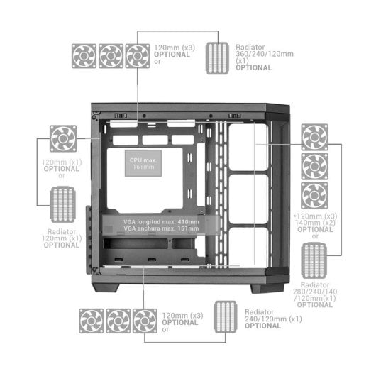
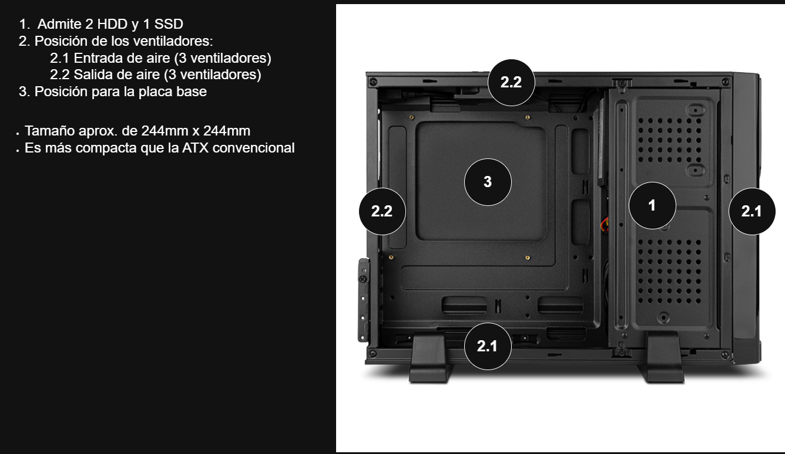
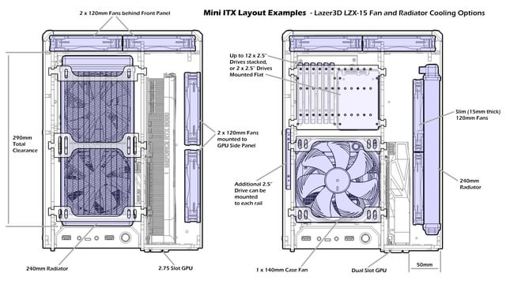

# Reto 02 — Análisis de Chasis (UT2 · RA1)
**Alumno/a:** Aarón López Pérez 
**Grupo:**  1º ASIR
**Fecha:**  08/11/2025
**Repositorio:** https://github.com/ALoP05/Proyecto_RA1_UT1/tree/main/retos/Reto_02_Analisis_Chasis

# Índice

1. [Portada](00-portada.md)
2. [Introducción](02-introduccion.md)
3. [Tabla de materiales](10-tabla_materiales/Tabla_de_materiales.md)
4. [Formatos y diagrama](20-formatos_y_diagrama/Diagrama_y_análisis.md)
5. [Caso práctico](30-caso_practico/Caso_práctico.md)
6. [Reflexión personal](40-reflexion_personal/Reflexión_personal.md)
7. [Entrega y checklist](99-entrega_y_checklist.md)

# Introducción

En este documento analizamos **materiales** (acero SECC, aluminio, plástico, vidrio templado y compuestos) y **formatos** de chasis (Mini torre vs. Micro torre), para entender cómo afectan a **capacidad de componentes**, **refrigeración** y **experiencia de usuario**. Finalmente, resolvemos un **caso práctico** de recomendación.

## 1) Tabla comparativa de materiales
# Tabla comparativa de materiales de chasis

| Material         | Ventajas (3–4)                                                                                                                  | Desventajas (2–3)                                                                                       | Aplicaciones comunes (ejemplos)                         |
| ------------------ | ---------------------------------------------------------------------------------------------------------------------------------- | ---------------------------------------------------------------------------------------------------------- | --------------------------------------------------------- |
| Acero SECC       | - Durabilidad - Resistencia - Económica                                                                               | - Poca personalización - Pesadas                                                                   | -Chasis industriales y consumo                          |
| Aluminio         | - Estética - Ligero - Disipador Pasivo                                                                                | - Menos resistente - Más caras                                                                     | - Cajas Premium - Tablets y smartphones            |
| Plástico        | - Ligero - Resistente a tensiones - Diseño Versátil                                                                  | - Débil a luz ultravioleta - No apto para uso industrial                                           | - Paneles frontales - Accesorios y acabados        |
| Vidrio templado  | - Más resistente que el vidrio común - En caso de rotura, genera trozos "seguros" - Moderna exhibición del hardware | - Afecta a la ventilación de mala manera -Tienden a dejar huecos pasando así el polvo al interior | - Paneles laterales - Chasis para alto rendimiento |
| Materiales comp. | - Versátiles - Resistente a corrosión                                                                                     | - Muy caras - Baja disponibilidad                                                                   | - Chasis industriales - Modding o alto rendimiento |

## 2) Formatos: diagrama y análisis
# Formatos de chasis: diagrama y análisis

**Formatos elegidos:** Mini ITX vs. Micro ATX

## Diagrama Micro ATX

## Impacto del tamaño (Micro ATX)
- **Capacidad de componentes:**  4 ranuras PCIe x16 para GPU y 4 zócalos para RAM, además de que admite placas base Mini ITX y Micro ATX.
- **Refrigeración:** Puede incluir refrigeración líquida (ligera), pero usualmente va por ventiladores. 
- **Uso típico:**  PCs de uso general, gaming y estaciones de trabajo compactas.

## Diagrama Mini ITX

* Admite de una a dos para SSD o HDD
* Refrigeración por ventiladores de 1 a 2 expulsando el aire caliente hacia arribao por detras dependiendo del modelo.
* Tamaño de 170 x 170mm
## Impacto del tamaño (Mini ITX)
- **Capacidad de componentes:**  Espacio para discos duros reducido, con pocas bahías, usualmente para 2.5" y alguna 3.5" en modelos específicos. Pocos espacios para GPU (normalmente solo 1).
- **Refrigeración:**  Limitada, necesita diseños eficientes y refrigeración compacta.
- **Uso típico:**  PC compactos, estaciones de trabajo pequeñas y HTPC.

## 3) Caso práctico
# Plantilla — Caso práctico: recomendación de chasis

**Necesidades del cliente:** 
- Máxima capacidad de almacenamiento (varios HDD/SSD)
- Múltiples tarjetas gráficas (diseño/simulación)
- Buena refrigeración

## 1) Formato recomendado
**Elección:**  Super Torre
**Por qué:** 13 bahías de disco (10 x 3.5" + 3 x 2.5"); mínimo 7 slots PCIe para GPU (x16); capacidad de almacenamiento de los componentes; refrigeración líquida pesada y minímo 9 ventiladores.

## 2) Material recomendado
**Elección:**  Materiales compuestos: Acero SECC, plástico y Vidrio Templado.
**Por qué:** Por su aguante, resistencia a la corrosión, la anulación de ruido, por su estética y su eficiente circulación de refrigerio (en caso de no usar líquida).

## 4) Reflexión personal
# Reflexión personal

El chasis es uno de los principales e imprescindibles componentes en un ordenador, y este varía dependiendo de su utilidad final. Es debido a esto que hay gran variedad de cajas a la hora de comprar una. Los aspectos más importantes a tener en cuenta son:

**El ruido:** Dependiendo del chasis que tengamos para nuestro PC, a la hora de funcionar hará más o menos ruido. Algunas cajas vienen con paneles de espuma o materiales aislantes que amortiguan el ruido de ventiladores y discos duros mecánicos. El grosor del material también influye, como el acero y aluminio robustos haciendo que tenga un menor impacto sonoro.

**La temperatura:** El calor que desprenden los componentes como la CPU o el disco duro debe ser expulsado de la caja, por eso un buen diseño de esta puede influir en el flujo de aire frío/caliente agregando elementos como mallas o canales internos. También se puede hacer uso de los filtros para evitar que entre polvo, ayudando a mantener el rendimiento térmico y limpieza. Además de que el tamaño hace la diferencia, porque te permite meter más ventiladores o radiadores en caso de refrigeración líquida.

**Acceso a puertos:** Una buena torre también debe tener su generosa cantidad de puertos a conexiones externos, los cuales se encuentran siempre en el panel frontal y trasero. Además de que debe tener unos cuantos espacios para conexiones de discos duros, los cuales dependen del tamaño de la caja.

**Estética:** Como se ha comentado antes, el material del chasis también importa, poseyendo características principales de cada material como: el aluminio transmite ligereza y modernidad; el acero da robustez y durabilidad; el vidrio templado añade estética premium y exhibe componentes. También se pueden agregar acabados y pinturas mate, anodizados y pulidos para que luzca como una verdadera caja premium y luces RGB impactantes.
