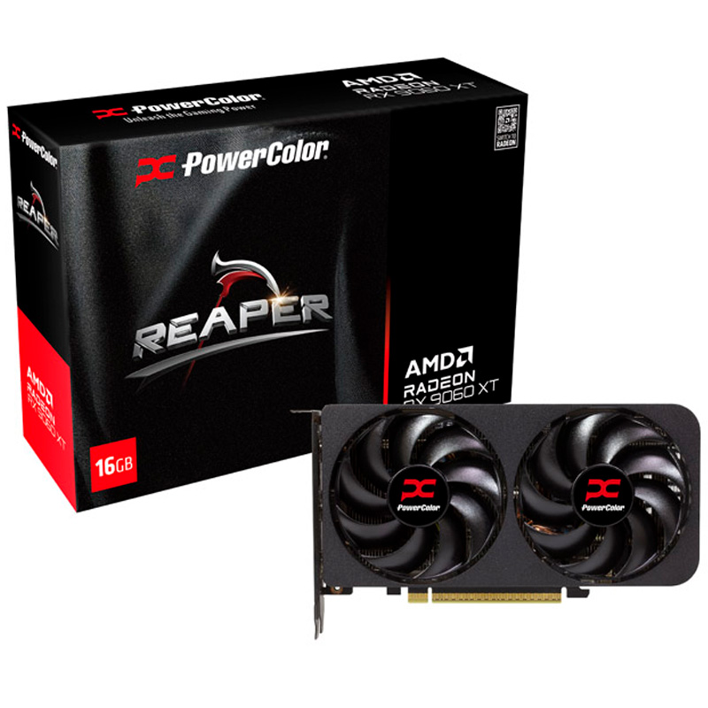
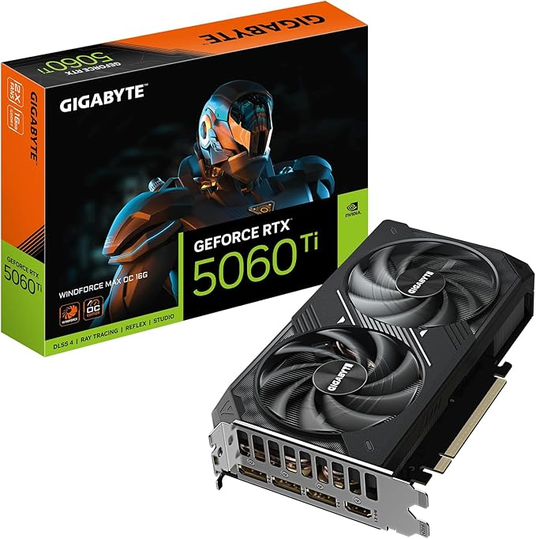
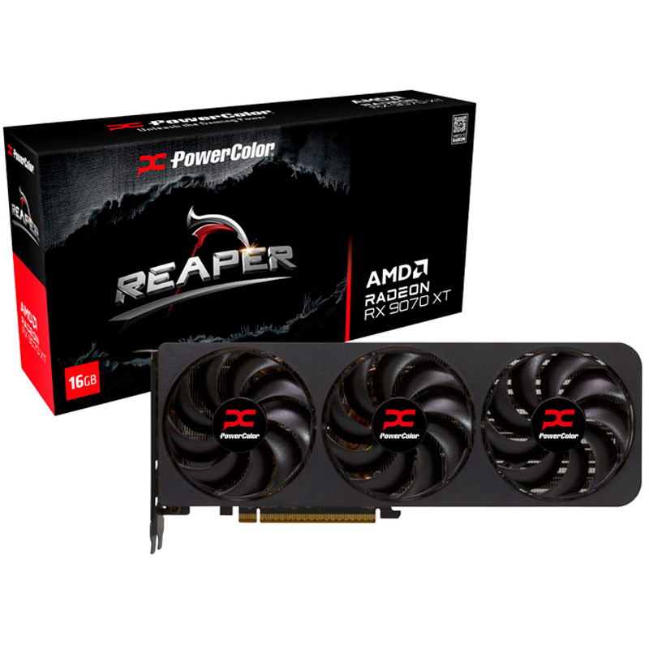
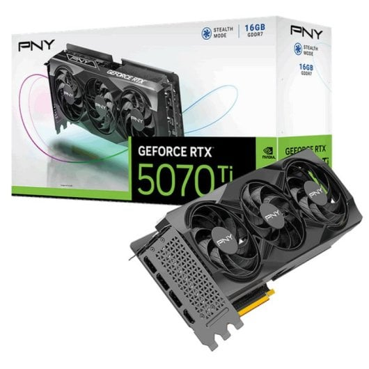

# Parte 3 — GPUs y precios reales (Black Friday 2025)

> Vídeo: **“Mejores Tarjetas Gráficas Calidad - Precio | TOP GPUs GAMING Black Friday 2025”**
> URL: https://www.youtube.com/watch?v=ILOtkTXLUvg

## 0) Portada

- Alumno/a: Aarón López Pérez
- Grupo: 1º ASIR
- Fecha: 06/12/2025

## 1) Introducción (5–10 líneas)

Voy a nalizar un vídeo comparativo de GPUs para mi PC y ver cuál de estas rentaría más para pillarse
este Black Friday. Abarcaremos franjas y tramos de presupuestos: desde los 200€, pasando por los 300€ y 600€
hasta alcanzar los 2000€ (que de primera mano, no va rentando).
Veremos las expecificaciones como la VRAM, capacidad del bus, el consumo, etc... Todo esto siendo respaldado
con pruebas que el mismo creador ha realizado con distintos juegos exigentes y no tan exigentes.

## 2) Tramos del vídeo y modelos mencionados

### 2.1 Tramo ~350 €

- Minuto inicio–fin: **07:43 a 09:31**
- GPUs citadas (2): **Reaper AMD Radeon RX 9060 XT**, **Palit GeForce RTX 5060 Ti Infinity 3**

### 2.2 Tramo 600–800 €

- Minuto inicio–fin: **11:36 – 14:06**
- GPUs citadas (2): **Reaper AMD Radeon RX 9070 XT**, **PNY GeForce RTX 5070 Ti**

**¿Se repite algún modelo entre tramos?** Explica brevemente.
Si, se repite la RTX 5070 Ti, pero la que recomienda si te puedes permitir pagar un poco más, es la que hemos puesto abajo:
la PNY GeForce RTX 5070 Ti 16GB. Pero si no, dice que compres la de 8GB

## 3) Precios reales en tiendas

> Inserta imágenes en `assets/img/30-parte3/` y enlaza con ruta relativa.

### 3.1 GPU del tramo 350 € — Modelo A

- Tienda: Coolmod
- Nombre exacto en tienda: Tarjeta Gráfica Powercolor Reaper AMD Radeon RX 9060 XT 16GB GDDR6
- Precio (€): 349,95€
- URL: https://www.coolmod.com/powercolor-reaper-amd-radeon-rx-9060-xt-16gb-gddr6/
- Imagen: 

### 3.2 GPU del tramo 350 € — Modelo B

- Tienda: PC Componentes
- Nombre exacto en tienda: Tarjeta Gráfica Palit GeForce RTX 5060 Ti Infinity 3 16GB GDDR7 Reflex 2 RTX AI DLSS4
- Precio (€): 449,90€
- URL: https://www.pccomponentes.com/tarjeta-grafica-palit-geforce-rtx-5060-ti-infinity-3-16gb-gddr7-reflex-2-rtx-ai-dlss4
- Imagen: 

### 3.3 GPU del tramo 600–800 € — Modelo C

- Tienda: Coolmod
- Nombre exacto en tienda: Tarjeta Gráfica PowerColor Reaper AMD Radeon RX 9070 XT 16GB GDDR6
- Precio (€): 599,95€
- URL: https://www.coolmod.com/powercolor-reaper-amd-radeon-rx-9070-xt-16gb-gddr6/
- Imagen: 

### 3.4 GPU del tramo 600–800 € — Modelo D

- Tienda: PC Componentes
- Nombre exacto en tienda: Tarjeta Gráfica PNY GeForce RTX 5070 Ti 16GB GDDR7 Reflex 2 RTX AI DLSS4
- Precio (€): 450,77€
- URL: https://www.pccomponentes.com/tarjeta-grafica-pny-geforce-rtx-5070-ti-8gb-gddr7-reflex-2-rtx-ai-dlss4
- Imagen: 

> Nota: Si no encuentras el mismo **ensamblador**, indica la diferencia manteniendo la misma **GPU**.

## 4) Tabla comparativa (precios reales)

| Tramo (vídeo) | GPU (modelo del vídeo)              | Tienda         | Precio (€) | URL                                                                                                                 | Imagen             |
| ---------------- | -------------------------------------- | ---------------- | ------------: | --------------------------------------------------------------------------------------------------------------------- | -------------------- |
| 350 €         | Reaper AMD Radeon RX 9060 XT         | Coolmod        |    349,95€ | https://www.coolmod.com/powercolor-reaper-amd-radeon-rx-9060-xt-16gb-gddr6/                                         | *(insertar abajo)* |
| 350 €         | Palit GeForce RTX 5060 Ti Infinity 3 | PC Componentes |    449,90€ | https://www.pccomponentes.com/tarjeta-grafica-palit-geforce-rtx-5060-ti-infinity-3-16gb-gddr7-reflex-2-rtx-ai-dlss4 | *(insertar abajo)* |
| 600–800 €    | Reaper AMD Radeon RX 9070 XT         | Coolmod        |    599,95€ | https://www.coolmod.com/powercolor-reaper-amd-radeon-rx-9070-xt-16gb-gddr6/                                         | *(insertar abajo)* |
| 600–800 €    | PNY GeForce RTX 5070 Ti              | PC Componentes |    450,77€ | https://www.pccomponentes.com/tarjeta-grafica-pny-geforce-rtx-5070-ti-8gb-gddr7-reflex-2-rtx-ai-dlss4               | *(insertar abajo)* |

## 5) Conclusión (5–8 líneas)

- ¿Los precios reales se parecen a lo que sugiere el vídeo?
  Sí y no. Actualmente las que pone que cuestan entre 600 y 800€ ahora están por menos de 600€ e incluso 500€.
  Sin embargo, con las de 350, la segunda se pasa un poco porque el simple hecho de que tiene una velocidad de 16GB
  y no de 8, como es la que originalmente recomienda y cuesta un poco menos pero acercándose a los 400€.
- ¿Cuál de las cuatro ofrece mejor **calidad-precio** y por qué?
  Calidad-precio ahora mismo la GEFORCE RTX 5070 Ti, porque a día de hoy, está rbajada casi al 50% y una ganga para la potencia
  y calidad de esta. Además, solo hay que ver 16GB GDDR7 por 450€, una absoluta locura.
- Observaciones finales.
  Los precios en este Black Friday estan cambiando mucho para bien (o para mal) y es el moento perfecto para revisar que puedes encontrar por muy bajo precio como esta última 5070 Ti.

## 6) Fuentes

- Tiendas:
  * https://www.coolmod.com/powercolor-reaper-amd-radeon-rx-9060-xt-16gb-gddr6/
  * https://www.pccomponentes.com/tarjeta-grafica-palit-geforce-rtx-5060-ti-infinity-3-16gb-gddr7-reflex-2-rtx-ai-dlss4
  * https://www.coolmod.com/powercolor-reaper-amd-radeon-rx-9070-xt-16gb-gddr6/
  * https://www.pccomponentes.com/tarjeta-grafica-pny-geforce-rtx-5070-ti-8gb-gddr7-reflex-2-rtx-ai-dlss4
- Vídeo: URL al inicio del documento.
