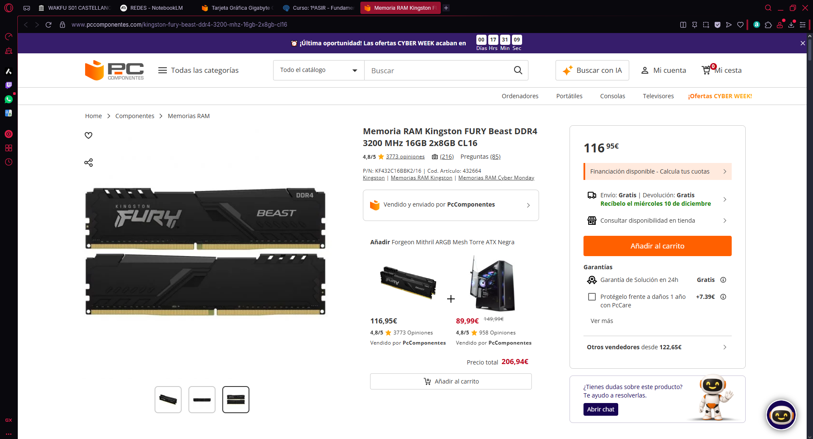
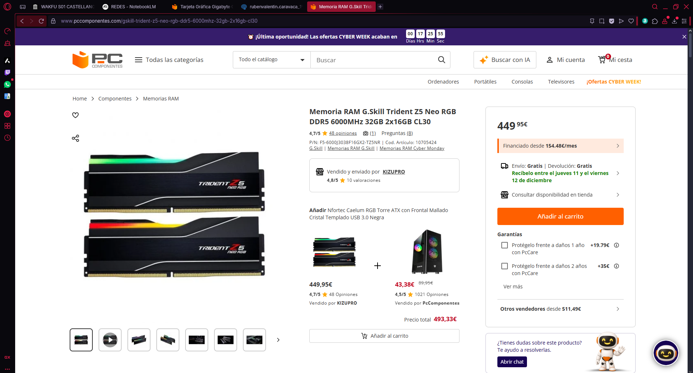
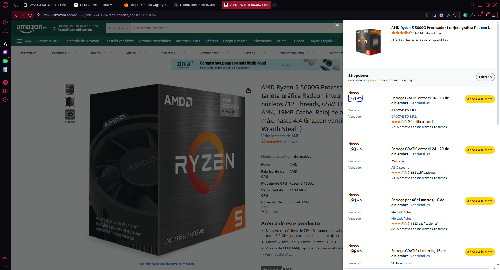
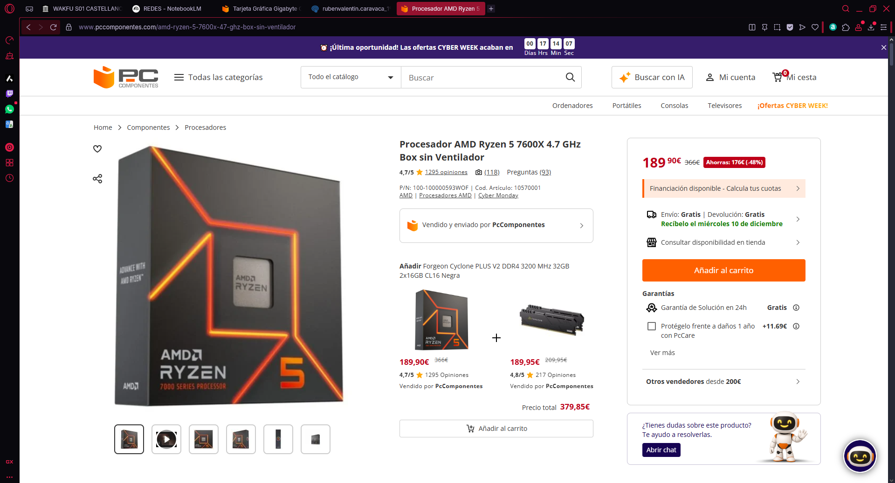

# Reto 03 — Elementos internos de un sistema informático (UT2 · RA1)

## Parte 1 — Actividades A y B
# Parte 1 — Actividades A y B (único archivo)

## Actividad A — Investigación de **Fuentes de Alimentación** (9 modelos)

**Instrucciones:**

1. Elige**3 tiendas online españolas/especializadas** (p. ej., PcComponentes, Amazon ES, LDLC ES).
2. En**cada tienda**, selecciona**un modelo ATX**,**uno SFX** y**uno TFX** (total 9).
3. Para cada modelo, recoge:**Marca/Modelo**,**Potencia (W)**,**Certificación 80 PLUS**,**Precio (€)**,**Modularidad**,**PFC (activo/pasivo)**,**Dimensiones (mm)**,**Enlace**.
4. Al final, incluye una**tabla resumen comparativa global**.

### Tienda 1: PC Componentes

| Tipo | Marca/Modelo                                                                 | Potencia (W) | 80 PLUS | Precio (€) | Modularidad | PFC    | Dimensiones (L×W×H mm) | Enlace                                                                                                                                      |
| ------ | ------------------------------------------------------------------------------ | -------------- | --------- | ------------: | ------------- | -------- | -------------------------- | --------------------------------------------------------------------------------------------------------------------------------------------- |
| ATX  | Tempest Pulse PSU 750W Cybenetics Bronze ATX 3.1                             | 750W         | Bronze  |     79.99€ | Sí         | Active | 150 x 85 x 140 mm        | https://www.pccomponentes.com/fuente-alimentacion-tempest-pulse-psu-750w-cybenetics-bronze-atx-31-full-modular-fuente-de-alimentacion-negra |
| SFX  | Fuente Alimentación UNYKAch Fuente de Alimentación SFX 300W 80 Plus Bronze | 300W         | Bronze  |     35.95€ | No          | Active | 125 x 100 x 65 mm        | https://www.pccomponentes.com/unykach-fuente-de-alimentacion-sfx-300w-80-plus-bronze                                                        |
| TFX  | be quiet! TFX Power 3 300W Gold                                              | 300W         | Gold    |     85.85€ | No          | Activo | 85 x 175 x 65 mm         | https://www.pccomponentes.com/fuente-alimentacion-fuente-de-alimentacion-be-quiet-300w-80plus-gold-tfx-power-3-compacta-silenciosa-pcie     |

**Notas/criterios de la tienda 1:** Excelente tienda para comprar y las especificaciones de los productos el 95% son exactas o correctas.

### Tienda 2: Amazon ES

| Tipo | Marca/Modelo                    | Potencia (W) | 80 PLUS | Precio (€) | Modularidad | PFC    | Dimensiones (L×W×H mm) | Enlace                                                                                         |
| ------ | --------------------------------- | -------------- | --------- | ------------: | ------------- | -------- | -------------------------- | ------------------------------------------------------------------------------------------------ |
| ATX  | Mars Gaming MPB1000PSI          | 1000W        | Gold    |     84,92€ | Sí         | Active | 150 x 160 x 85 mm        | https://www.amazon.es/Mars-Gaming-MPB1000PSI-Alimentaci%C3%B3n-Ventilador/dp/B0F2T6SGTR/       |
| SFX  | GAMEMAX GS-850G                 | 850W         | Gold    |   134,99 € | Sí         | Active | 125 × 110 × 63,5 mm    | https://www.amazon.es/GAMEMAX-Alimentaci%C3%B3n-850W-Condensadores-Protecciones/dp/B0F4PKRJF6) |
| TFX  | UNYKAch TFX 350W 80 Plus Bronze | 350W         | Bronze  |     31,51€ | No          | Active | 175 x 85 x 65 mm         | https://www.amazon.es/UNYKAch-Fuente-Alimentaci%C3%B3n-Ventilador-Silencioso/dp/B095PM5618/    |

**Notas/criterios de la tienda 2:** Es una tienda bastante general que lo más seguro es que tengan lo que buscas o algo similar. Los filtros son específicos por no tanto como LDLC.

### Tienda 3: LDLC ES

| Tipo | Marca/Modelo           | Potencia (W) | 80 PLUS         | Precio (€) | Modularidad | PFC    | Dimensiones (L×W×H mm) | Enlace                                           |
| ------ | ------------------------ | -------------- | ----------------- | ------------: | ------------- | -------- | -------------------------- | -------------------------------------------------- |
| ATX  | Corsair RM850e         | 850 W        | Cybenetics Gold |    107,95€ | Sí         | Activo | 150 x 150 x 86 mm        | https://www.ldlc.com/es-es/ficha/PB00663406.html |
| SFX  | Seasonic FOCUS SPX-650 | 650W         | Platinum        |    139,95€ | Sí         | Activo | 100 x 125 x 63.5 mm      | https://www.ldlc.com/es-es/ficha/PB00590124.html |
| TFX  | Chieftec GPF-350P TFX  | 300W         | Bronze          |    110,95€ | No          | Active | 175 x 85 x 65 mm         | https://www.ldlc.com/es-es/ficha/PB00648540.html |

**Notas/criterios de la tienda 3:** La tienda tiene muchos filtros para que los usuarios puedan encontrar exactamente lo que buscan. Pero no tienen unicamente fuentes TFX, vienen en cajas.

#### Tabla **resumen comparativa** (global, 9 modelos)

| Tienda         | Tipo | Marca/Modelo                                     | Potencia (W) | 80 PLUS         | Precio (€) | Modularidad | PFC    | Dimensiones (mm)   | Observaciones                                                  |
| ---------------- | ------ | -------------------------------------------------- | -------------- | ----------------- | ------------- | ------------- | -------- | -------------------- | ---------------------------------------------------------------- |
| PC Componentes | ATX  | Tempest Pulse PSU 750W Cybenetics Bronze ATX 3.1 | 750W         | Bronze          | 79.99€     | Sí         | Active | 150 × 85 × 140   | Full modular, buena relación calidad‑precio                  |
| PC Componentes | SFX  | UNYKAch SFX 300W 80 Plus Bronze                  | 300W         | Bronze          | 35.95€     | No          | Active | 125 × 100 × 65   | Muy económica para equipos de bajo consumo                    |
| PC Componentes | TFX  | be quiet! TFX Power 3 300W Gold                  | 300W         | Gold            | 85.85€     | No          | Activo | 85 × 175 × 65    | Marca reconocida, alta eficiencia en formato TFX               |
| Amazon ES      | ATX  | Mars Gaming MPB1000PSI                           | 1000W        | Gold            | 84.92€     | Sí         | Active | 150 × 160 × 85   | Mucha potencia a precio ajustado para gaming                   |
| Amazon ES      | SFX  | GAMEMAX GS-850G                                  | 850W         | Gold            | 134.99€    | Sí         | Active | 125 × 110 × 63.5 | SFX de alta potencia, adecuada para equipos compactos potentes |
| Amazon ES      | TFX  | UNYKAch TFX 350W 80 Plus Bronze                  | 350W         | Bronze          | 31.51€     | No          | Active | 175 × 85 × 65    | Una de las TFX más baratas, básica pero suficiente           |
| LDLC ES        | ATX  | Corsair RM850e                                   | 850W         | Cybenetics Gold | 107.95€    | Sí         | Activo | 150 × 150 × 86   | Gama media‑alta, muy equilibrada para PCs exigentes           |
| LDLC ES        | SFX  | Seasonic FOCUS SPX‑650                          | 650W         | Platinum        | 139.95€    | Sí         | Activo | 100 × 125 × 63.5 | Alta eficiencia y calidad en formato SFX                       |
| LDLC ES        | TFX  | Chieftec GPF‑350P TFX                           | 300W         | Bronze          | 110.95€    | No          | Active | 175 × 85 × 65    | Precio alto para TFX, pero de marca reconocida                 |

## Actividad B — **Refrigeración para la MISMA CPU** (Líquida vs Pasiva)

**Instrucciones:**

1. Elige una**CPU concreta** (ej.: Intel Core i9-13900, AMD Ryzen 9 7950X…). Indícala abajo.
2. Selecciona**una refrigeración líquida AIO** y **una refrigeración pasiva****compatibles** con esa CPU. Incluye **URLs** oficiales o de tienda.
3. Compara **precio, eficiencia térmica (TDP soportado/temperaturas), ruido, dimensiones, compatibilidad de socket, mantenimiento, garantía**…
4. **Concluye** con recomendaciones por perfil (**gamer**,**diseño/pro**,**usuario estándar**) y **calidad-precio**.

**CPU elegida:** Intel Core i9-13900

### Modelos evaluados

| **Tipo**           | **Marca/Modelo**                         | **Precio (€)** | **TDP soportado / Rendimiento térmico** | **Ruido (dBA)**                             | **Dimensiones (mm)**        | **Sockets**              | **Mantenimiento**                 | **Garantía** | **Enlace**                                                                                                                 |
| -------------------- | ------------------------------------------ | ----------------- | ------------------------------------------ | --------------------------------------------- | ----------------------------- | -------------------------- | ----------------------------------- | --------------- | ---------------------------------------------------------------------------------------------------------------------------- |
| **Líquida (AIO)** | **Corsair iCUE H150i ELITE CAPELLIX XT** | 97,14€         | **Alto (>250W)**                         | 5 - 34.1 dBA (Puede variar según la carga) | Radiador: 397 x 120 x 27 mm | LGA 1700, 1200, AM5, AM4 | **Bajo** (Limpiar polvo radiador) | 5 Años       | [PC Componentes](https://www.pccomponentes.com/corsair-icue-h100i-elite-capellix-xt-kit-refrigeracion-liquida-240mm-negra) |
| **Pasiva**         | **Noctua NH-P1**                         | 152,89€        | **Bajo (100-120W)**                      | **0 dBA**                                   | 158 x 154 x 152 mm          | LGA 1700, AM5, AM4       | **Nulo** (Sin partes móviles)    | 6 Años       | [PC Componentes](https://www.pccomponentes.com/noctua-nh-p1-disipador-pasivo-cpu)                                          |

### Análisis y elección por perfil

- **Gamer:** Refrigeración líquida, porque los juegos exigen picos de rendimiento y el i9-13900 genera mucho calor rápido; la líquida lo disipa eficientemente manteniendo los FPS estables. La pasiva provocaría *thermal throttling* (bajada de velocidad) a los pocos minutos de juego.
- **Profesional de diseño/simulación:** Refrigeración líquida, ya que en tareas de renderizado (Blender, Cinebench, Premiere), la CPU se pone al 100% de carga constante durante horas. El i9 alcanzará los 219W de consumo. El disipador pasivo es físicamente incapaz de disipar esa energía, lo que resultaría en apagados por seguridad o un rendimiento pésimo.
- **Usuario estándar/ofimática:** Refrigeración pasiva, solo recomendable si el silencio absoluto es necesario y el uso de CPU es bajo. Para que funcione con un i9-13900, es **obligatorio** entrar en la BIOS y limitar el consumo de energía (Eco Mode) para que la CPU no supere los 90-100W, desperdiciando gran parte de la potencia del procesador.

### Conclusión general

Para el Intel Core i9-13900, es recomendable usar refrigeración líquida porque este procesador está diseñado para funcionar caliente y consumir mucha energía; intentar enfriarlo pasivamente es contraintuitivo y limita el hardware por el que has pagado.

* **Líquida:** Permite usar el 100% del procesador. Más cara y tiene partes mecánicas (bomba) que pueden fallar a largo plazo, es necesaria para esta gama.
* **Pasiva:** Es un producto excelente, pero no para un i9. El Noctua NH-P1 brilla con procesadores de gama media (i5, Ryzen 5) o versiones "T" de bajo consumo. Usarlo en un i9 requiere *undervolting* agresivo, lo cual hace que la relación calidad-precio sea mala.

## Parte 2 — Componentes y DDR5 (archivo único)

## 1) Búsqueda de componentes

Para cada uno: **marca/modelo**, **características**, **precio**, **URL**, **captura**, **justificación**.

### RAM oficina

- Marca/Modelo: Kingston FURY Beast DDR4
- Capacidad/Velocidad/Tipo: 16GB (2x8GB) / 3200MHz / DDR4 CL16
- Precio: 116,95€
- URL: https://www.pccomponentes.com/kingston-fury-beast-ddr4-3200-mhz-16gb-2x8gb-cl16
- Captura: 
- Justificación: 16GB en dual channel es lo ideal para multitarea fluida en Windows 10/11 además de la fiabilidad de Kingston.

### RAM gaming

- Marca/Modelo: G.Skill Trident Z5 NEO RGB (DDR5)
- Capacidad/Velocidad/Tipo: 32GB (2x16GB) / 6000MHz / DDR5 CL30
- Precio: 450,95€
- URL: https://www.pccomponentes.com/gskill-trident-z5-neo-rgb-ddr5-6000mhz-32gb-2x16gb-cl30?srsltid=AfmBOopOiYTG-_Q4WNawgzvmA7-gw3kVlHXblH1aC1A257TJTSIrN_zx
- Captura: 
- Justificación: Tienen una latencia ultrabaja, lo que mejora los fotogramas mínimos en juegos competitivos y el disipador es más robusto para aguantar sesiones largas de juego.

### CPU oficina

- Marca/Modelo: AMD Ryzen 5 5600G
- Núcleos/Hilos/Frecuencia: 6 Núcleos / 12 Hilos / 3.9 GHz (Turbo 4.4 GHz)
- TDP/Gráfica integrada (si aplica): 65W / Radeon Vega 7 Graphics
- Precio: 161,99€
- URL: https://www.amazon.es/AMD-Ryzen-5600G-Wraith-Stealth/dp/B092L9GF5N
- Captura: 
- Justificación: Es la mejor alternativa a Intel para oficina (he querido cambiar un poco). A diferencia del Intel i3 (el que iba a escoger en un principio), este tiene 6 núcleos, lo que le da más vida útil a futuro. Posee una gráfica integrada Radeon Vega, que es mucho más potente que la de Intel, permitiendo incluso diseño gráfico ligero o ver vídeos en 4K con total soltura.

### CPU gaming

- Marca/Modelo: AMD Ryzen 5 7600X
- Núcleos/Hilos/Frecuencia: 6 Núcleos / 12 Hilos / 4.7 GHz (Turbo 5.3 GHz)
- TDP: 105W
- Precio: 189,90€
- URL: https://www.pccomponentes.com/amd-ryzen-5-7600x-47-ghz-box-sin-ventilador
- Captura: 
- Justificación: Es la opción inteligente económicamente. Aunque tiene "solo" 6 núcleos, son rapidísimos y mueven cualquier juego actual sin problemas. Al usar la plataforma AM5, te asegura que en 3 o 4 años podrás cambiar solo la CPU por una nueva sin tener que cambiar la placa base ni la RAM. Ofrece el 90% del rendimiento de los procesadores caros por casi la mitad de precio.

## 2) Tabla comparativa RAM (DDR4 vs DDR5)

| **Atributo**       | **DDR4**                                                                  | **DDR5**                                                                                               |
| -------------------- | --------------------------------------------------------------------------- | -------------------------------------------------------------------------------------------------------- |
| **Velocidad**      | Limitada. 3600-4000 MT/s.                                                 | Muy alta. 7200-8000 MT/s.                                                                              |
| **Consumo**        | 1.2V                                                                      | 1.1V                                                                                                   |
| **Precio**         | De 80/200€                                                               | De 200/500€                                                                                           |
| **Compatibilidad** | Estándar universal. Funciona en casi cualquier PC de los últimos años. | Exclusiva de plataformas nuevas (Intel Gen 12/13/14 y AMD Ryzen 7000/9000). Requiere placa base nueva. |

## 3) Investigación DDR5

- Ventajas respecto a DDR4: Tiene una mayor capacidad por módulo (128 GB en teoría), duplica la longitud por ráfaga a 16 y el refresco independiente de un banco mientras los otros siguen operando
- Usos principales donde más se nota: En simulación, emulación, render 3D, máquinas virtuales y gaming con juegos exigentes.
- Ejemplo de dispositivo/situación especialmente ventajosa: Un desarrollador de Big Data e IA, diseño y modelaje 3D con Blender y Streaming de alta exigencia.

## Parte 3 — GPUs y precios reales (Black Friday 2025)

> Vídeo: **“Mejores Tarjetas Gráficas Calidad - Precio | TOP GPUs GAMING Black Friday 2025”**
> URL: https://www.youtube.com/watch?v=ILOtkTXLUvg

## 0) Portada

- Alumno/a: Aarón López Pérez
- Grupo: 1º ASIR
- Fecha: 06/12/2025

## 1) Introducción (5–10 líneas)

Voy a nalizar un vídeo comparativo de GPUs para mi PC y ver cuál de estas rentaría más para pillarse
este Black Friday. Abarcaremos franjas y tramos de presupuestos: desde los 200€, pasando por los 300€ y 600€
hasta alcanzar los 2000€ (que de primera mano, no va rentando).
Veremos las expecificaciones como la VRAM, capacidad del bus, el consumo, etc... Todo esto siendo respaldado
con pruebas que el mismo creador ha realizado con distintos juegos exigentes y no tan exigentes.

## 2) Tramos del vídeo y modelos mencionados

### 2.1 Tramo ~350 €

- Minuto inicio–fin: **07:43 a 09:31**
- GPUs citadas (2): **Reaper AMD Radeon RX 9060 XT**, **Palit GeForce RTX 5060 Ti Infinity 3**

### 2.2 Tramo 600–800 €

- Minuto inicio–fin: **11:36 – 14:06**
- GPUs citadas (2): **Reaper AMD Radeon RX 9070 XT**, **PNY GeForce RTX 5070 Ti**

**¿Se repite algún modelo entre tramos?** Explica brevemente.
Si, se repite la RTX 5070 Ti, pero la que recomienda si te puedes permitir pagar un poco más, es la que hemos puesto abajo:
la PNY GeForce RTX 5070 Ti 16GB. Pero si no, dice que compres la de 8GB

## 3) Precios reales en tiendas

> Inserta imágenes en `assets/img/30-parte3/` y enlaza con ruta relativa.

### 3.1 GPU del tramo 350 € — Modelo A

- Tienda: Coolmod
- Nombre exacto en tienda: Tarjeta Gráfica Powercolor Reaper AMD Radeon RX 9060 XT 16GB GDDR6
- Precio (€): 349,95€
- URL: https://www.coolmod.com/powercolor-reaper-amd-radeon-rx-9060-xt-16gb-gddr6/
- Imagen: 

### 3.2 GPU del tramo 350 € — Modelo B

- Tienda: PC Componentes
- Nombre exacto en tienda: Tarjeta Gráfica Palit GeForce RTX 5060 Ti Infinity 3 16GB GDDR7 Reflex 2 RTX AI DLSS4
- Precio (€): 449,90€
- URL: https://www.pccomponentes.com/tarjeta-grafica-palit-geforce-rtx-5060-ti-infinity-3-16gb-gddr7-reflex-2-rtx-ai-dlss4
- Imagen: 

### 3.3 GPU del tramo 600–800 € — Modelo C

- Tienda: Coolmod
- Nombre exacto en tienda: Tarjeta Gráfica PowerColor Reaper AMD Radeon RX 9070 XT 16GB GDDR6
- Precio (€): 599,95€
- URL: https://www.coolmod.com/powercolor-reaper-amd-radeon-rx-9070-xt-16gb-gddr6/
- Imagen: 

### 3.4 GPU del tramo 600–800 € — Modelo D

- Tienda: PC Componentes
- Nombre exacto en tienda: Tarjeta Gráfica PNY GeForce RTX 5070 Ti 16GB GDDR7 Reflex 2 RTX AI DLSS4
- Precio (€): 450,77€
- URL: https://www.pccomponentes.com/tarjeta-grafica-pny-geforce-rtx-5070-ti-8gb-gddr7-reflex-2-rtx-ai-dlss4
- Imagen: 

> Nota: Si no encuentras el mismo **ensamblador**, indica la diferencia manteniendo la misma **GPU**.

## 4) Tabla comparativa (precios reales)

| Tramo (vídeo) | GPU (modelo del vídeo)              | Tienda         | Precio (€) | URL                                                                                                                 | Imagen             |
| ---------------- | -------------------------------------- | ---------------- | ------------: | --------------------------------------------------------------------------------------------------------------------- | -------------------- |
| 350 €         | Reaper AMD Radeon RX 9060 XT         | Coolmod        |    349,95€ | https://www.coolmod.com/powercolor-reaper-amd-radeon-rx-9060-xt-16gb-gddr6/                                         | *(insertar abajo)* |
| 350 €         | Palit GeForce RTX 5060 Ti Infinity 3 | PC Componentes |    449,90€ | https://www.pccomponentes.com/tarjeta-grafica-palit-geforce-rtx-5060-ti-infinity-3-16gb-gddr7-reflex-2-rtx-ai-dlss4 | *(insertar abajo)* |
| 600–800 €    | Reaper AMD Radeon RX 9070 XT         | Coolmod        |    599,95€ | https://www.coolmod.com/powercolor-reaper-amd-radeon-rx-9070-xt-16gb-gddr6/                                         | *(insertar abajo)* |
| 600–800 €    | PNY GeForce RTX 5070 Ti              | PC Componentes |    450,77€ | https://www.pccomponentes.com/tarjeta-grafica-pny-geforce-rtx-5070-ti-8gb-gddr7-reflex-2-rtx-ai-dlss4               | *(insertar abajo)* |

## 5) Conclusión (5–8 líneas)

- ¿Los precios reales se parecen a lo que sugiere el vídeo?
  Sí y no. Actualmente las que pone que cuestan entre 600 y 800€ ahora están por menos de 600€ e incluso 500€.
  Sin embargo, con las de 350, la segunda se pasa un poco porque el simple hecho de que tiene una velocidad de 16GB
  y no de 8, como es la que originalmente recomienda y cuesta un poco menos pero acercándose a los 400€.
- ¿Cuál de las cuatro ofrece mejor **calidad-precio** y por qué?
  Calidad-precio ahora mismo la GEFORCE RTX 5070 Ti, porque a día de hoy, está rebajada casi al 50% y una ganga para la potencia
  y calidad de esta. Además, solo hay que ver 16GB GDDR7 por 450€, una absoluta locura.
- Observaciones finales.
  Los precios en este Black Friday estan cambiando mucho para bien (o para mal) y es el moento perfecto para revisar que puedes encontrar por muy bajo precio como esta última 5070 Ti.

## 6) Fuentes

- Tiendas:
  * https://www.coolmod.com/powercolor-reaper-amd-radeon-rx-9060-xt-16gb-gddr6/
  * https://www.pccomponentes.com/tarjeta-grafica-palit-geforce-rtx-5060-ti-infinity-3-16gb-gddr7-reflex-2-rtx-ai-dlss4
  * https://www.coolmod.com/powercolor-reaper-amd-radeon-rx-9070-xt-16gb-gddr6/
  * https://www.pccomponentes.com/tarjeta-grafica-pny-geforce-rtx-5070-ti-8gb-gddr7-reflex-2-rtx-ai-dlss4
- Vídeo: URL al inicio del documento.

